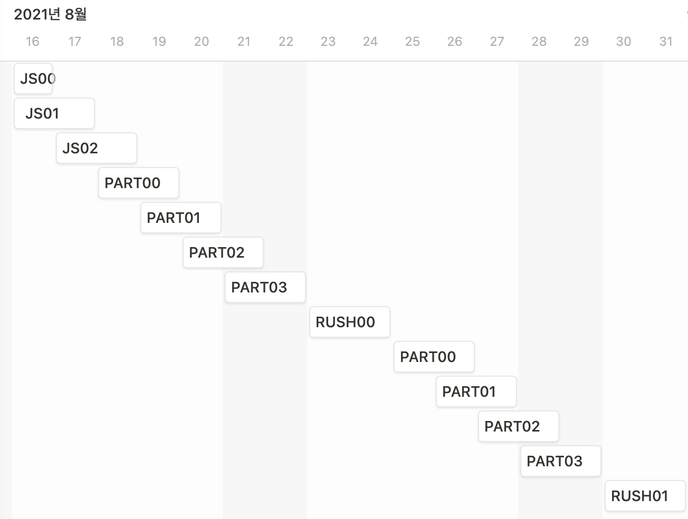

<h1 align="center">JS Piscine</h1>
<h4 align="center">🔥 Javascript crunch course from scratch</h4>

42 Cadet들이 만드는 Javascript 단기 교육과정, 피씬(Piscine) 프로젝트입니다

> ℹ️ 해당 레포는 2021/08/16 ~ 2021/09/01 피신 진행을 아카이브 하고 있습니다.
>
> JS Piscine에 대한 최신 소식을 알고 싶다면 아래의 레포로 들어가서 확인해주세요!
>
> https://github.com/42js/piscine

## 🗒 커리큘럼

> 🏃 피씬 참여자를 두 팀으로 나누어 한팀은 JS -> FE -> Rush00 -> BE -> Rush01 다른 팀은 FE와 BE를 순서를 바꾸어 진행합니다.

> 🆙 베타 서브젝트는 8/11 오전 중 업로드될 예정입니다!

 

### JS - Javascript 101
* [JS00](js00) : JS 기초 문법 - const와 let, 데이터 타입, 객체
* [JS01](js01) : DOM 조작
* [JS02](js02) : 동기 & 비동기

 

### FE - React
* [FE00](fe00) : JSX, Props와 State, 컴포넌트의 종류, 컴포넌트 라이프사이클
* [FE01](fe01) : Form control, React Styling
* [FE02](fe02) : API 사용하기
* [FE03](fe03) : FE 종합

 

### BE - Express
* [BE00](be00) : Node.js, Validator, 템플릿
* [BE01](be01) : Database, ORM, CURD
* [BE02](be02) : 인증, Passport
* [BE03](be03) : BE 종합

 

* Rush00 : ??? (팀당 1~2명씩 총 2명이서 진행하는 프로젝트)
* Rush01 : ??? (팀 상관없이 랜덤으로 3~4명이서 진행하는 프로젝트)

> 😥 Rush의 목표가 "짧은 시간 내에 협업하는 것"이기 때문에 기간 한정으로 공개되는 점 양해 부탁드립니다.

 

### 베타 진행 일정

> ⏰ 제출 마감 시각은 마감일 KST 23:41:59이고, 제출한 서브젝트의 평가 기간은 마감 날짜 KST 23:42:00부터 익일 KST 23:41:59까지 입니다.

 

## ✍️ 제출 방법
피씬이 진행중일 때엔 Github의 Pull Request를 적극 활용해 제출 & 평가를 진행합니다!

1. 가장 먼저 현재 이 레포지토리를 본인 계정으로 fork합니다.
2. `(본인 intra id)/(서브젝트 이름)`(예를들어 `sunpark/js00`)으로 브랜치를 만듭니다.
3. 열심히 문제를 풀면서 진행한 내용을 커밋합니다.
4. **제출 기간 내에** 이 레포지토리에 Pull Request를 제출합니다.
  > - 해당 repo를 fork 합니다.
  > - 본인의 repo에 push, 그 후 이쪽 repo로 pull request를 보내주세요.
  > - pull request 제목 형식: `[Subject] Slack ID *일차` (e.g. `[FE00] PolarBear 1일차`)
5. 제출 기간이 마감되면 평가자를 리뷰어로 지정해드릴 예정입니다. 지정된 리뷰어와 **평가 기간 내에** 일정을 잡아 평가를 진행합니다. (평가지는 슬랙에 올라갈 예정입니다)
6. 평가가 완료되면 평과 결과지를 점수, 평가자, 피평가자가 보이게 캡쳐하고 피드백과 같이 제출합니다.

> 🚨 모든 마감 시각 기준은 Github 서버시간 기준입니다. 기간을 지키지 않는 제출내용은 무조건 0점입니다.

> 🚨 마감 이후 해당 PR의 Branch에 commit, force-push, 내용 변경을 하면 안됩니다. 이 또한 기간을 지키지 않는 제출내용으로 간주해 0점을 부여할 예정입니다.

> 🚨 서브젝트당 단 하나의 PR만이 존재해야 합니다. Close 후 다시 PR 날리는 것도 0점을 부여 하게 됩니다.

> 🚨 또한 해당 PR에는 해당 서브젝트에 관련된 파일만을 수정하여 제출 해야 합니다. 이러한 항목을 지키지 않는 제출은 0점을 부여하게 됩니다.

## 🏊‍♀️ Piscine이란?

Piscine은 프랑스어로 '수영장'이란 단어입니다. 42에서 피씬은 수영을 못하는 사람들을 갑자기 수영장에 던져지면 생존을 위해 수영하는 법을 배우는 것처럼, 새로운 프로그래밍 언어를 배울 때 맨땅에 헤딩하듯 가르침 없이 문제만 주어지는 교육과정입니다.

42에 들어올려면 선발과정인 C Piscine을 통과해야함으로, 42에서 Piscine은 익숙한 교육과정입니다. 본과정에도 다양한 언어의 피씬이 존재하고, 42 학생들이 직접 만든 피씬도 존재합니다. 대표적으로 [42AI](https://github.com/42-AI)의 [Python Bootcamp](https://github.com/42-AI/bootcamp_python)가 있습니다.

## 📢 안내사항

- 현재 JS Piscine은 베타 버젼입니다! 상단 커리큘럼은 변경될 수 있습니다.
- 예제에 오류가 있거나, 새로운 예제를 추가하고 싶거나, 새로운 주제를 추가하고 싶으시거나 등등... JS Piscine 기여는 언제나 환영입니다! [Issue](https://github.com/42js/piscine/issues)를 통해 언제든지 기여해주세요! 추가적으로, 42분들이라면 슬랙에서 42JS를 찾아주세요!
- Currently only Korean version is available. Other language support is up in the air, but if you're interested in translate, please contact us.

## 🧑‍💻 기여자

### 💻 42JS
42JS는 42 캠퍼스에서의 Javascript 관련 지식 공유 및 능력 발전을 위한 42Seoul의 공식 커뮤니티입니다!

- [Sungwoo Park (sunpark)](https://github.com/cos18): 총괄 리더, JS00, JS02, FE02, Rush01 제작 참여
- [Jaeseo Kim (jaeskim)](https://github.com/JaeSeoKim): 진행 리더, JS02, BE00, BE02, Rush00 제작 참여
- [hochan Lee (holee)](https://github.com/hochan222): JS00, FE03, Rush00 제작 참여
- [Jeongjun Kim (jekim)](https://github.com/Two-Jay): JS00, BE00, BE03, Rush01 제작 참여
- [Sarang Choi (sarchoi)](https://github.com/srngch): JS01, BE00, BE01, Rush01 제작 참여
- [Seonghee Jin (sejin)](https://github.com/MichelleJin12): JS01, FE00, FE01, Rush00 제작 참여

## 📚 License
 This work is licensed under a <a rel="license" href="http://creativecommons.org/licenses/by-nc-sa/4.0/">Creative Commons Attribution-NonCommercial-ShareAlike 4.0 International License</a>.
