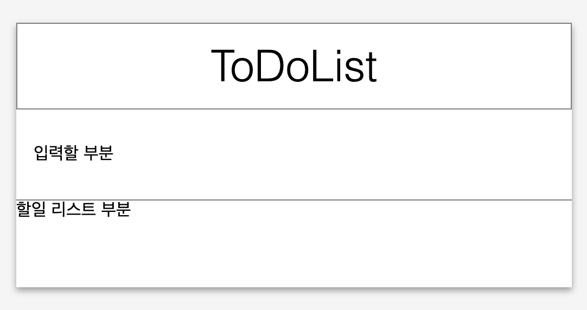

# Exercise 00 - 안녕 리액트!

|                      |                    |
| --------------------:| ------------------ |
|   제출할 폴더 이름 :     |  ex00              |
|   제출할 파일 이름 :     | index.html, App.js, index.js, 이 외 리액트 프로젝트에 필요한 모든 파일|
|   사용 가능한 외부 모듈 : |                    |
|   참고사항 :           |                    |

제출할 파일 이름은 바뀌거나, 제거되거나, 추가되어도 됩니다.

create-react-app(CRA)을 설치하고, 디폴트로 설정되어있는 Welcome to React 페이지가 잘 나타난다면 이제 나만의 템플릿 페이지를 만들 차례입니다.

App.js 내부 function App()에 jsx를 사용하여 ToDoList 템플릿을 만들고 리턴하여 ToDoList 템플릿 페이지를 띄워보세요.

jsx가 아닌 일반 html 파일을 작성하면 안됩니다.

이 과정은 ToDoList의 틀을 만드는 과정으로 기능은 작동하지 않아도 됩니다.

ToDoList 템플릿은 유저가 ToDo를 입력할 섹션과, 입력한 ToDo가 리스트로 나타날 섹션이 필수로 있어야 합니다.
section tag를 사용하세요.

