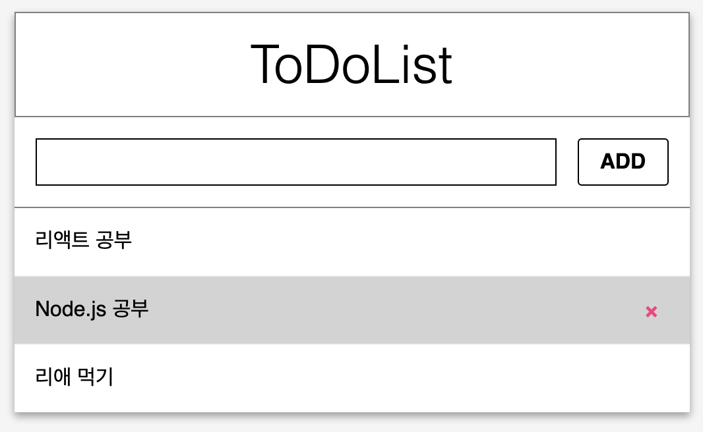

# Exercise 02 - Input과 Item

|                      |                    |
| --------------------:| ------------------ |
|   제출할 폴더 이름 :     |  ex02              |
|   제출할 파일 이름 :     |  index.html, src/App.js, index.js, ToDoListTemplate.js, ToDoListTemplate.css, Input.js, Input.css, Item.js, Item.css, ItemList.js, 이 외 리액트 프로젝트에 필요한 모든 파일 |
|   사용 가능한 외부 모듈 : |                 |
|   참고사항 :           |                  |

제출할 파일 이름은 바뀌거나, 제거되거나, 추가되어도 됩니다.

ex01에서 만든 ToDoList 템플릿에 컴포넌트를 추가해봅시다.

Item을 입력하고, 추가할 수 있는 Input component를 만드세요.
Item을 입력할 수 있는 섹션과 ADD 버튼이 들어갈 섹션이 있어야 합니다.

ADD버튼을 누르면 Item list에 추가될 Item component를 만드세요.
마우스가 특정 Item에 올라가면 Item의 스타일이 바뀌게 구현하세요.
유저가 특정 Item을 삭제할 수 있게 각 Item에 delete 버튼을 만드세요.

추가된 Item들을 보여주는 ItemList component를 만들고 App.js에서 불러와 렌더링하세요.
ItemList 컴포넌트는 Item 컴포넌트를 불러와 렌더링합니다.

Input component는 Input.js에, Item component는 Item.js에, ItemList component는 ItemList.js에 구현하세요.

모두 클래스 컴포넌트로 구현해야 합니다.

