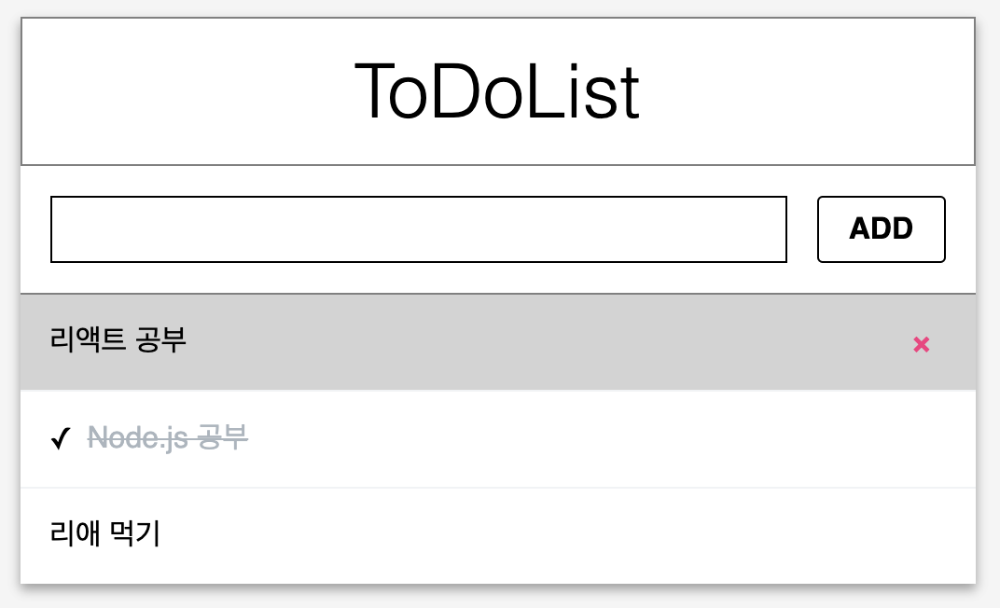

# Exercise 04 - Check와 Remove

|                      |                    |
| --------------------:| ------------------ |
|   제출할 폴더 이름 :     |  ex04              |
|   제출할 파일 이름 :     |  index.html, App.js, index.js, ToDoListTemplate.js, ToDoListTemplate.css, Input.js, Input.css, Items.js, Items.css, ItemList.js, 이 외 리액트 프로젝트에 필요한 모든 파일  |
|   사용 가능한 외부 모듈 : |                    |
|   참고사항 :           |                    |

제출할 파일 이름은 바뀌거나, 제거되거나, 추가되어도 됩니다.

이제 ToDoList의 기능을 구현해봅시다.

유저가 Item을 클릭하면 Item 왼쪽에 체크 표시가 생기고, Item의 스타일이 변하는 기능을 구현하세요.
유저가 다시 Item을 클릭하면 체크 표시가 사라지고, 원래대로 돌아가는 기능을 구현하세요.
유저가 Item의 delete 버튼을 클릭하면 Item이 삭제되게 하세요.

