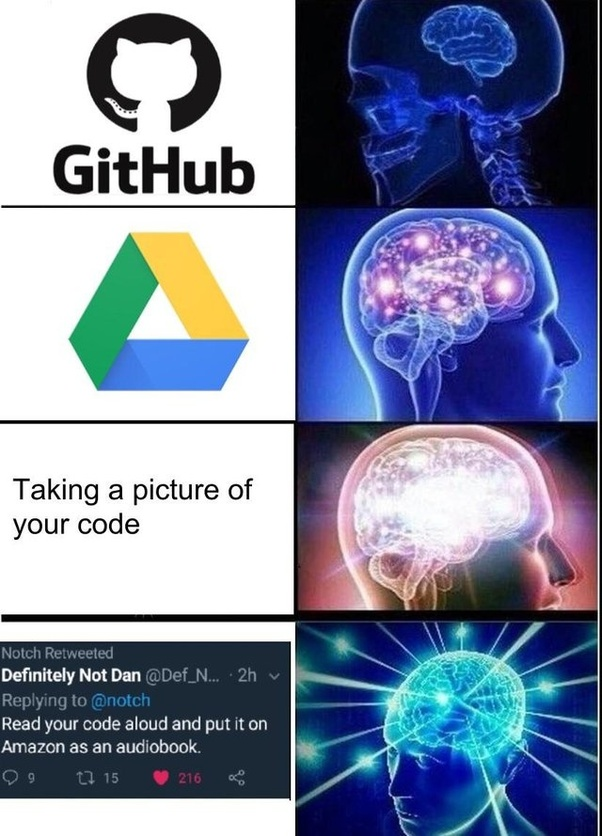
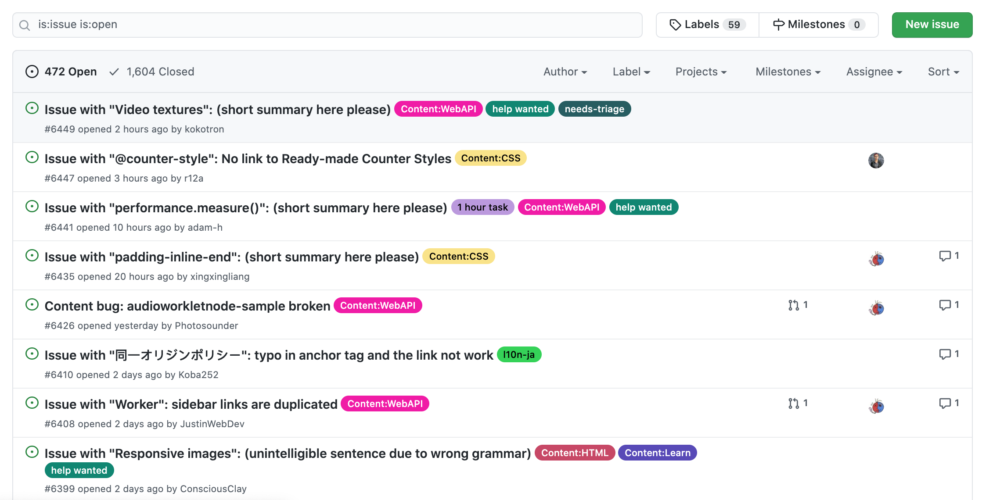

# JS Piscine

# FE 03

## 기본 규칙

* JS Piscine에서 사용하는 Node.JS 버젼은 LTS 14.x입니다.
* 문제들은 난이도 오름차순으로 배치되어 있습니다.
* 여러분들의 코드는 동료평가를 통해 평가될 예정이기 때문에 **다른 사람이 읽기 쉽도록** 작성해주세요! (예를 들어 변수명을 의미있게 정하거나, 함수 이름을 기능에 맞게 작명하는 것 처럼요.)
* 함수를 구현하는 문제의 경우, 평가시 모듈을 통해 함수를 가져옵니다. 따라서 제출할 함수코드를 export 해야합니다.
  - 구현해야 할 함수가 한가지일 경우, `default export` 처리해야 합니다.
* **nodemon**, **ESlint** 와 같은 개발에 관한 모듈은 `devdependencies` 에 정의가 되어 있어야 합니다.
* 평가 진행 전 `npm install` 명령어를 통해 사전 dependency 모듈들을 모두 설치 합니다.
* `node_modules` 와 같은 불 필요한 파일은 `.gitignore` 를 통해 적절하게 제외되어야 합니다.
* Code Format에 대하여 평가하지는 않지만, eslint나 beautify를 통해 code format을 체크하면서 진행하는 것을 권장합니다.
* **RTFM!!**
* 서브젝트는 제출 마감 1시간 전까지 변경될 수 있습니다.
* 만약 문제에 오류(오타나 논리적 오류)를 발견했다면 [깃헙 리포지토리](https://github.com/42js/piscine)에 이슈를 등록해주세요. 여러분의 도움으로 JS Piscine이 더욱 완벽해집니다 :)

## FE 03 - 나만의 Issue Tracker
|                      |                    |
| --------------------:| ------------------ |
|   제출할 폴더 이름 :     |  fe03              |
|   제출할 파일 이름 :     |  제한 없음           |
|   사용 가능한 외부 모듈 : |  제한 없음           |
|   참고사항 :           |  없음               |

 

<h2 align="middle">나만의 Issue Tracker</h2>

React와 Github v3 API로 나만의 Issue Tracker를 만들어보아요.

> 라이브러리/프레임워크에는 제한이 없고 자유롭다. 하지만, 라이브러리/프레임워크를 사용하는 이유는 상대방을 설득할 수 있어야 한다.

> 준수한 UI/UX를 구성해야한다.

## 기능 구현

- 특정 저장소를 검색할 수 있다.
- 검색된 저장소의 이슈를 목록으로 나타낼 수 있다.
- 이슈를 생성/편집/삭제할 수 있다.
- 이슈 기능
  - 담당자를 지정/삭제할 수 있다.
  - 댓글을 생성/편집/수정할 수 있다.
  - 라벨을 생성/편집/삭제할 수 있다.
  - 댓글을 잠금/해제할 수 있다.
  - 이슈를 닫거나 열 수 있다.
- 이슈, 라벨을 무한 스크롤링으로 목록을 나타낼 수 있다.
- 이슈를 상단에 pin할 수 있다.
  - pin 이슈들은 `drag and drop`을 통해 카드 순서를 바꿀 수 있다.
- 모든 동작은 새로고침 없이 페이지에 바로 반영돼야 한다.
- Github v3 API을 이용해서 해당 페이지에서 적용된 내용이 실제 Github에서 적용되게 한다.
- Github v3 API에 대한 Error Handling을 해야한다.

> `presentation container pattern`과 같은 디자인 패턴을 찾아보세요.

## 보너스

- 무한 스크롤링에 `쓰로틀링(throttling)`과 `디바운싱(debouncing)`중 하나를 선택해서 적용한다.
- 새로고침을 하더라도 이전 검색 기록이 남아있다.
- 마일스톤을 생성/편집/삭제할 수 있다.
  - 마일스톤은 무한 스크롤링으로 목록을 나타낼 수 있다.
- 검색된 검색어는 3개까지 저장할 수 있다.
  - 검색어는 브라우저를 종료해도 유지되어야한다.
- 모든 빈 페이지에 대해 대체 이미지가 있다.
- `Skeleton UI` 를 적용한다.
- CSS 전처리기를 이용해 구현한다.
- 다크 모드를 지원한다.
  - 다크모드는 input을 통해 지원되어야한다. 
  - input의 type은 checkbox 이다.
  
> https://docs.github.com/en/rest
