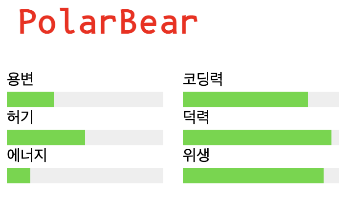
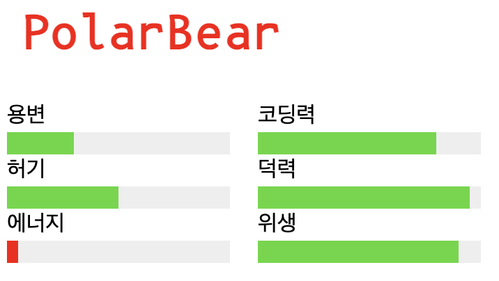
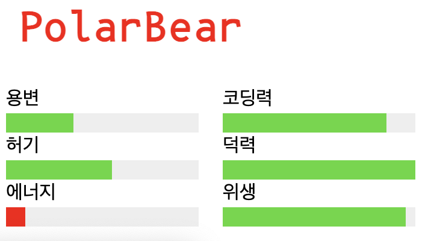

# Exercise 01 - 폴라베어

|                      |                      |
| --------------------:| -------------------- |
|   제출할 폴더 이름 :     |  ex01                |
|   제출할 파일 이름 :     |  ex01.html, ex01.js  |
|   사용 가능한 외부 모듈 : |  없음                 |
|   참고사항 :           |  ex01.css            |

시간이 지나면 progress bar가 변하는 페이지를 만드세요. 제공된 ex01.css를 보고 HTML과 JS를 작성하세요.

- 제공된 ex01.css 파일은 추가하거나, 삭제할 수 없고, HTML은 직접 작성해야합니다.
- Internal Style Sheet를 허용하지 않습니다.
- External Javascript를 사용하세요.
- querySelector를 사용할 수 있습니다.

- javascript가 로딩된 후,
- 에너지 progressbar를 10 줄이고 색이 빨간색으로 바뀌게 JS를 작성하세요.
- 5초 후 모든 progressbar가 5 증가하도록 JS를 작성하세요.
