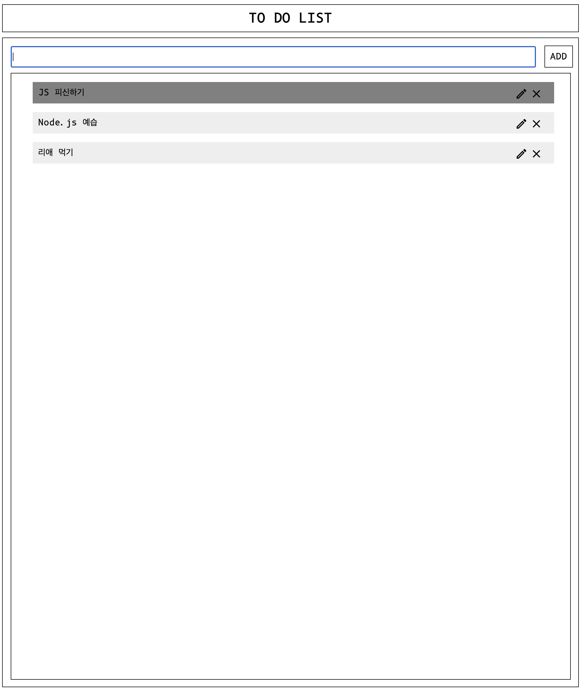

# ex05 - ToDoList

|                      |                      |
| --------------------:| -------------------- |
|   제출할 폴더 이름 :     |  ex05                |
|   제출할 파일 이름 :     |  ex05.html, ex05.js ex05.css |
|   사용 가능한 외부 모듈 : |  없음                 |
|   참고사항 :           |  없음                 |

생성, 체크, 업데이트, 제거 기능을 가진 ToDoList를 HTML, CSS, JS을 사용하여 구현하세요.

Internal Style Sheet를 허용하지 않습니다.

- 예시는 예시일 뿐입니다. 자유롭게 커스터마이징하세요.
- CRUD 기능은 필수입니다.
- ToDo에 마우스가 올라갔을 때, 사용자가 알 수 있도록 ToDo 항목의 스타일을 변경하세요. 색을 변화시키거나, 폰트를 바꾸거나 원하는대로 커스터마이징하세요.
- ToDo를 클릭 했을 때, 어떤 방식이로든 체크되어 사용자가 사용할 수 있게 하세요.
- ToDo를 삭제할 수 있는 기능을 구현하세요.
- ToDo 목록에 있는 항목 내용을 바꿀 수 있는 Update 기능을 구현하세요.
- ToDo 목록을 localStorage에 저장하고, 창을 닫고 다시 띄웠을 때 ToDo 목록이 다시 뜨게 하세요.
